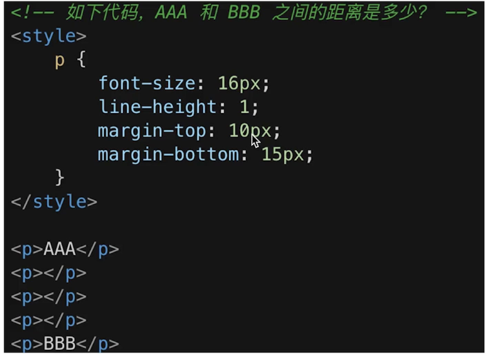
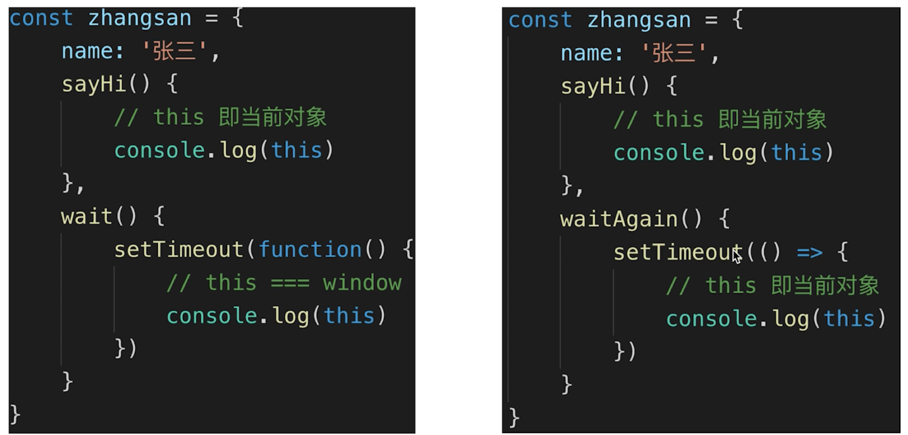

# HTML

## 如何理解 HTML 语义化

- 让人更容易读懂（增加代码可读性）
- 让搜索引擎更容易读懂 （ SEO）

## 块状元素 ＆内联元素

- display: block/table; 有 div h1 h2 table ul ol p 等
- display: inline/inline-block;有 span img input button 等

# CSS

## 盒模型竞度计算

offsetWidth = （内容宽度 ＋ 内边距 ＋ 边框），无外边距
offsetHeight = （内容高度 ＋ 内边距 ＋ 边框），无外边距

## margin 纵向重叠问题



- 相邻元素的 margin-top 和 margin-bottom 会发生重叠
- 空白内容的`<p></p>`也会重叠
- 答案：15px

## margin 负值问题

- margin-top 和 margin-left 负值，元素向上、向左移动
- margin-right 负值，右侧元素左移，自身不受影响
- margin-bottom 负值，下方元素上移，自身不受影响

## BFC 理解与应用

### 概念

- Block format context，块级格式化上下文
- 一块独立渲染区域，内部元素的渲染不会影响边界以外的元素

### BFC 常见形成条件

- float 不是 none
- position 是 absolute 或 fixed
- overflow 不是 visible
- display 是 flex inline-block 等

### BFC 常见应用

清除浮动

## float 布局

### 如何实现圣杯布局和双飞翼布局

圣杯布局和双飞翼布局的目的

- 三栏布局，中间一栏最先加载和渲染（内容最重要）
- 两侧内容固定，中间内容随着宽度自适应
- 一般用于 PC 网页

圣杯布局和双飞翼布局的技术总结

- 使用 float 布局
- 两侧使用 margin 负值，以便和中间内容横向重叠
- 防止中间内容被两侧覆盖，一个用 padding 一个用 margin

```html
<!-- 圣杯布局 -->
<!-- 利用padding完成 -->
<style>
  .container {
    padding-left: 200px;
    padding-right: 150px;
  }
  .main {
    background-color: yellow;
    float: left;
    width: 100%;
  }
  .left {
    width: 200px;
    background-color: red;
    float: left;
    margin-left: -100%;
    position: relative;
    left: -200px;
  }
  .right {
    width: 150px;
    background-color: blue;
    float: left;
    margin-right: -150px;
  }
</style>

<div class="container">
  <div class="main">中间内容</div>
  <div class="left">左边</div>
  <div class="right">右边</div>
</div>
```

```html
<!-- 双飞翼布局 -->
<!-- 利用marin完成 -->
<style>
  .container {
    background-color: yellow;
    width: 100%;
    float: left;
  }
  .main {
    margin-left: 200px;
    margin-right: 150px;
  }
  .left {
    width: 200px;
    background-color: red;
    float: left;
    margin-left: -100%;
  }
  .right {
    width: 150px;
    background-color: blue;
    float: left;
    margin-left: -150px;
  }
</style>

<div class="container">
  <div class="main">中间内容</div>
</div>
<div class="left">左边</div>
<div class="right">右边</div>
```

### 手写 clearfix

footer 为需要清除浮动的元素

```html
<div class="container clearfix">
  <div class="main">中间内容</div>
  <div class="left">左边</div>
  <div class="right">右边</div>
</div>
<div class="footer">footer</div>
```

```css
.clearfix:after {
  content: "";
  display: table;
  clear: both;
}
```

## flex 画骰子

主要利用`align-self`属性，允许单个项目有与其他项目不一样的对齐方式，可覆盖`align-items`属性。默认值为`auto`，表示继承父元素的`align-items`属性，如果没有父元素，则等同于`stretch`

```html
<style>
  .container {
    display: flex;
    justify-content: space-between;
    width: 120px;
    height: 120px;
    border: 1px solid black;
    padding: 10px;
  }
  .item {
    background-color: #666;
    border-radius: 50%;
    width: 30px;
    height: 30px;
  }
  .second {
    align-self: center;
  }
  .last {
    align-self: flex-end;
  }
</style>
<div class="container">
  <div class="item"></div>
  <div class="item second"></div>
  <div class="item last"></div>
</div>
```

## css 定位

### absolute 和 relative 定位

- relative 依据自身定位
- absolute 依据最近一层的定位元素定位(absolute relative fixed body)

### 居中对齐的实现方式

#### 水平居中

- inline 元素：text-align:center
- block 元素：margin:auto
- absolute 元素：left: 50% + margin-left 负值

#### 垂直居中

- inline 元素：line-height 的值等于 height 值
- absolute 元素：top:50% + margin-top 负值
- absolute 元素：transform(-50%,-50%)
- absolute 元素：top, left, bottom, right = 0 + margin:auto

## line-height 如何继承

- 写具体数值，如 30px，则继承该值
- 写比例，如 2/1.5，则继承该比例
- 写百分比，如 200%，则继承计算出来的值

**line-height 继承父元素百分比行高时，先进行计算再继承给子元素**

```css
.father {
  font-size: 20px;
  line-height: 200%;
}
.son {
  font-size: 16px;
  /* 子元素继承来的行高为20*200%=40 */
}
```

# JS

## 数据类型

### 实现深拷贝

```js
function deepClone(obj) {
  if (typeof obj !== "object" || obj === null) {
    return obj;
  }
  let result;
  if (obj instanceof Array) {
    result = [];
  } else {
    result = {};
  }
  for (const key in obj) {
    // 保证key不是原型的属性
    if (obj.hasOwnProperty(key)) {
      // 递归调用
      result[key] = deepClone(obj[key]);
    }
  }
  return result;
}
```

## 原型和原型链

### 类型判断 instanceof

```js
[] instanceof Array; // true
[] instanceof Object; // true
{} instanceof Object // true
```

### 原型

```js
// class 实际上是函数，可见是语法糖
typeof People; // 'function'
typeof Student; // 'function'

// 隐式原型和显式原型
console.log(xialuo.__proto__);
console.log(Student.prototype);
console.log(xialuo.__proto__ === Student.prototype); // true
```

- 每个 class 都有显式原型 prototype
- 每个实例都有隐式原型`__proto__`
- 实例的`__proto__`指向对应 class 的 prototype

## 作用域和闭包

### 自由变量

- 一个变量在当前作用域没有定义，但被使用了
- 向上级作用域，一层一层依次寻找，直至找到为止
- 如果到全局作用域都没找到，则报错 xxx is not defined

### 闭包

作用域应用的特殊情况，有两种表现：

- 函数作为参数被传递
- 函数作为返回值被返回

**所有自由变量的查找，是在函数定义的地方向上级作用域查找，不是在执行的地方**

### this

this 取值为执行的地方决定


### 手写 bind 函数

```js
// 模拟bind
Function.prototype.bind1 = function() {
  // 将参数拆解为数组
  const args = Array.prototype.slice.call(arguments);
  // 或者用...运算符
  // const args = [...arguments].slice(1);
  // 获取this(即数组第一项)
  const t = args.shift();
  // fn.bind(...)中的fn
  const self = this;
  // 返回一个函数
  return function() {
    return self.apply(t, args);
  };
};
```

## 异步和单线程

### 异步和同步

- 基于 JS 是单线程语言
- 异步不会阳塞代码执行
- 同步会阻塞代码执行
